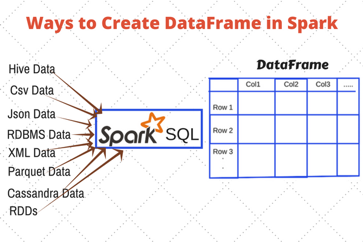

### Dataframes in PySpark

In Apache Spark, a DataFrame is a distributed collection of rows under named columns. 

In simple terms, they are similar to a table in relational database or an Excel sheet with Column headers. 

Dataframes also share some common characteristics with RDDs:

* Immutable in nature : We can create a DataFrame / RDD once but can’t change it. And we can transform a DataFrame / RDD after applying transformations.

* Lazy Evaluations:   Which means that a task is not executed until an action is performed.

* Distributed: RDD and DataFrames are both distributed in nature.

---------

#### Why DataFrames are Useful ?

DataFrames are designed for processing large collection of structured or semi-structured data.
Observations in Spark DataFrame are organised under named columns, which helps Apache Spark to understand the schema 
of a  DataFrame. This helps Spark optimize execution plan on these queries.
DataFrames in Apache Spark have the ability to handle petabytes of data.

---------

#### DataFrames support a wide range of data format and sources.

---------

#### Important classes of Spark SQL and DataFrames:

`pyspark.sql.DataFrame` A distributed collection of data grouped into named columns.

`pyspark.sql.Column` A column expression in a DataFrame.

`pyspark.sql.Row` A row of data in a DataFrame.

`pyspark.sql.GroupedData` Aggregation methods, returned by DataFrame.groupBy().

`pyspark.sql.DataFrameNaFunctions` Methods for handling missing data (null values).

`pyspark.sql.DataFrameStatFunctions` Methods for statistics functionality.

`pyspark.sql.functions` List of built-in functions available for DataFrame.

`pyspark.sql.types` List of data types available.

`pyspark.sql.Window` For working with window functions.
